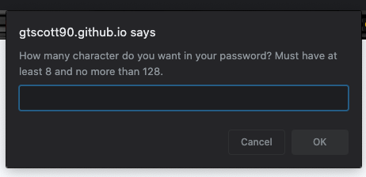
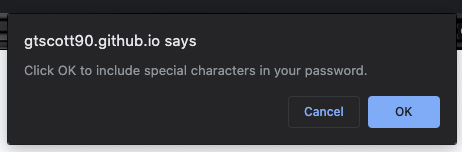
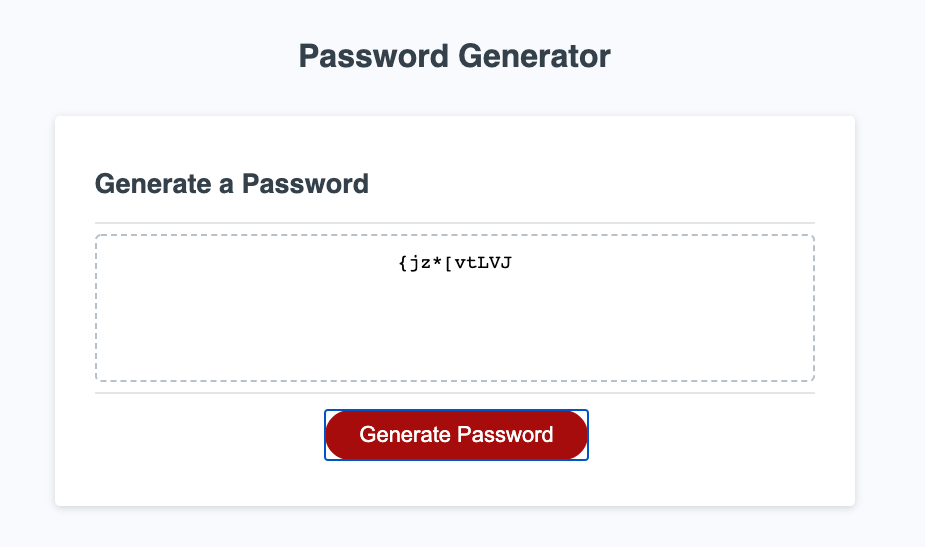

# Random Password Generator

## Description 

The purspose of the application to generate random passwords based on user selected criteria. Random passwords are more secure and harder to hack, making this application useful for anyone looking to increase security for their logins. 

### Usage
Users can load this page and see prompt to enter the number of characters they desire for the password. They must enter a number ranging from 8 to 128 before moving on to select various kinds of characters to include in the password (uppercase, lowercase, special charcters, and numbers). After the user selects either OK or Cancel for each type of character, they must click the generage password button in order for their randomly generated password to appear on the screen. The user can click the generate password button as many times as they want and there will be a new randomly generated password each time that fits the given critea they gave. If the user wishes to select new criteria they only need to refresh the page. 

### Screenshots
#### Initial prompt when opening the website:

#### Series of confirmations that let user select style of characters:

#### Random Password Generated:

### Links
Link to github reposity: https://github.com/gtscott90/password-generator 
Link to deployed application: https://gtscott90.github.io/password-generator/
